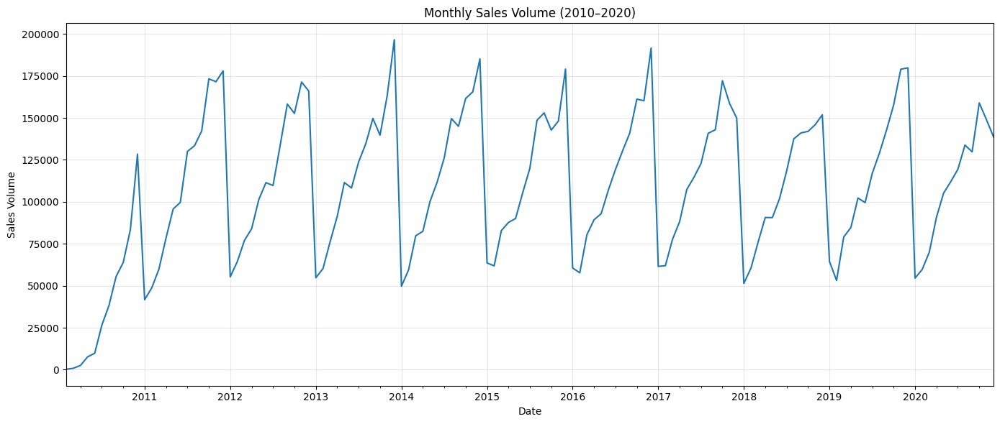
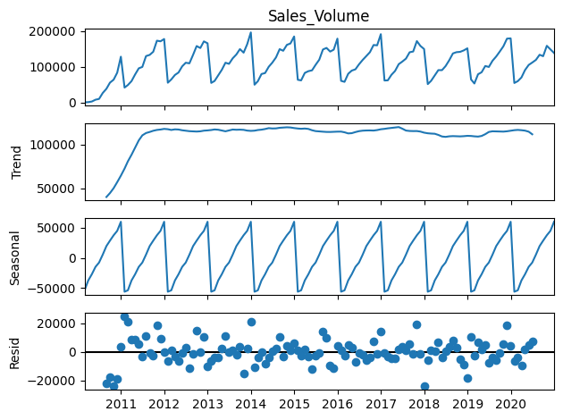
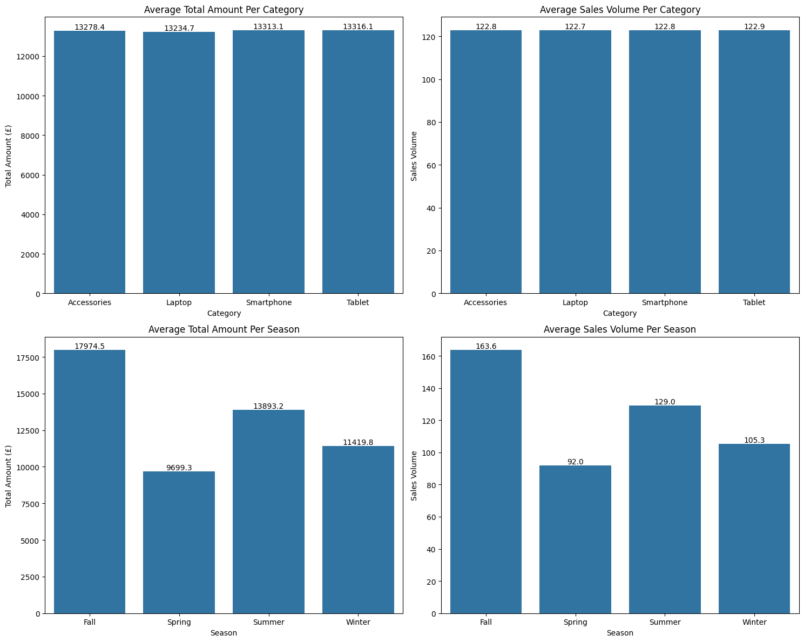

# ElectroTech Forecasting Data

## Project Overview & Methodology

This project implements a comprehensive sales forecasting system for ElectroTech, a fast-moving consumer electronics company. The system predicts sales volumes at multiple time granularities (weekly, monthly, quarterly, and annual) using time series analysis and machine learning techniques.

### Data Sources

The project processes daily transactional data containing:
- **Product Information**: Product ID, Category (Laptop, Smartphone, Tablet, Accessories), Specifications
- **Sales Data**: Sales Volume, Price
- **External Factors**: Market Trend Index, Competitor Activity Score, Consumer Confidence Index
- **Temporal Features**: Date, Season (Spring, Summer, Fall, Winter)


### Data Processing Pipeline

1. **Data Cleaning**: 
   - There were no null values in this dataset therefore none was imputed or removed
   - There were no duplicate rows in this dataset therefore none was removed
   - Handled outliers using the winsorisation technique
   - Corrected data types
   - Validated date ranges

2. **Exploratory Data Analysis**:
   - Analysed sales trends across products and time periods
   
   

   Looking at the above image, I assume there is annual seasonality with sale peaks around the end of year each year (Nov-Dec).

   

   According to the decomposition, the seasonal component captures repeating patterns at yearly intervals. There is a clear regular pattern with values oscillating between 50k and -50k. The repeating patterns indicate that seasonality is present, with predictable increases and decreases in sales volume at specific times of the year. The trend component rises in the first year, then plateaus and is relatively stable with no significant long term increase or decrease in sales volume over time.
   
   - Identified seasonal patterns

   After conducting hypothesis testing to prove seasonality/trending, I did not find a significant increasing trend, however, the data is dominated by seasonal fluctiations.

   - Examined correlations between features
   
   There is no multicollinearity amongst the features.

   - Visualised distributions and relationships

   

   The average total revenue acquired is balanced across all product categories at around £13250

   The average total sales volume is balanced across all product categories too at around 122 sales.

   Fall season has the highest average total revenue generated by £17974.5, with the lowest at Spring by £9699.3

   Fall has the highest average sales volume by 163.6, with Spring having the lowest at 92.


3. **Model Training & Evaluation**:
   - 80/20 train-test split
   - Cross-validation for hyperparameter tuning
   - Experiment tracking with MLflow
   - Model persistence for deployment

---

### Feature Engineering

The data pipeline includes sophisticated feature engineering:

1. **New Features**: Created new based on the existing columns including:
   - *Total Amount:* This is the product of the sales volume and the price.
   - *RFM scores:* This includes the frequency, recency, and monetary of the products.

2. **Lag Features**: Created lag variables for 1, 7, and 30 days for key metrics including:
   - Sales Volume
   - Price
   - Market Trend Index
   - Competitor Activity Score
   - Consumer Confidence Index

2. **Categorical Encoding**: One-hot encoded categorical variables (Product Category, Season, Product Specifications)

3. **Feature Selection**: Applied mutual information regression to identify the most predictive features for model training

### Modeling Approach

Two complementary modeling strategies were implemented:

1. **SARIMAX Models** (Seasonal AutoRegressive Integrated Moving Average with eXogenous variables):
   - Designed for time series forecasting with seasonal patterns
   - Incorporates external regressors for enhanced accuracy (Season)
   - Separate models trained for weekly, monthly, quarterly, and annual predictions
   - Optimised using auto arima for order and seasonal order parameters

2. **Random Forest Regression**:
   - Ensemble learning approach for robust predictions
   - Handles non-linear relationships effectively
   - Alternative forecasting method for comparison


## Model Performance

The table below compares the performance of all trained models using standard regression metrics:

| Model | Frequency | MAE | RMSE | R² Score |
|-------|-----------|-----|------|----------|
| SARIMAX | Weekly | 14.91 | 19.14 | 0.863 |
| SARIMAX | Monthly | 0.76 | 1.03 | 0.99 |
| SARIMAX | Quarterly | 0.76 | 1.03 | 0.99 |
| SARIMAX | Annual | 0.78 | 1.01 | 0.99 |
| Random Forest | Weekly (Daily Data) | 1.53 | 1.51 | 0.999 |
| Random Forest | Monthly (Weeky Resample) | 0.54 | 2.25 | 0.999 |


### Performance Metrics Explained

- **MAE (Mean Absolute Error)**: Average absolute difference between predicted and actual sales volumes. Lower values indicate better performance.
- **RMSE (Root Mean Squared Error)**: Square root of average squared differences, giving more weight to larger errors. Lower values indicate better accuracy.
- **R² Score**: Proportion of variance in sales volumes explained by the model. Values closer to 1 indicate better model fit.

### Key Findings

- The **Random Forest model** achieves exceptional performance (R² = 0.999) on weekly predictions using daily data, demonstrating the power of ensemble methods
- The **SARIMAX models** provided stronger performance than Random Forest Models with the lower MAE and RMSE since they capture seasonal patterns effectively. Therefore these models wer implemented in the API.
- Both models successfully leverage external variables (market trends, competitor activity, consumer confidence) to improve forecast accuracy

---

## Application Overview

### Streamlit Interactive Dashboard

The project includes a user-friendly Streamlit web application (`deploy/streamlit.py`) that enables business users to:

- **Select Forecast Frequency**: Choose between monthly, quarterly, or annual forecasts
- **Configure Forecast Horizon**: Specify the number of periods to forecast (1-30 steps)
- **Set Start Date**: Define when the forecast should begin
- **Input Operational Context**:
  - Product Category (Accessories, Laptop, Smartphone, Tablet)
  - Season (Fall, Spring, Winter, Summer) 
  - Product Specification (High-Resolution, Lightweight, Long-Battery-Life)
  
- **Provide Lag Features**: Enter lagged values for market indicators:
  - Lag reference period (Yesterday, Last week, Last month)
  - Historical values for Competitor Activity Score, Consumer Confidence Index, Market Trend Index, and Price

- **Enter Current Values**: Input current operational metrics
- **Visualise Forecasts**: View interactive Plotly charts of predicted sales volumes
- **Download Results**: Export forecast data as tables

### Architecture

The application follows a microservices architecture:

1. **Frontend**: Streamlit dashboard for user interaction
2. **API Backend** (`deploy/inference.py`): FastAPI service handling prediction requests
3. **Model Storage**: Pickle-serialised trained models for fast inference
4. **Environment Configuration**: `.env` file for API endpoint configuration

---

## Business Impact

### Practical Insights Enabled

1. **Inventory Optimisation**:
   - Forecast-driven inventory planning reduces stockouts and overstock situations
   - Weekly predictions enable just-in-time procurement strategies
   - Category-specific forecasts allow targeted inventory allocation

2. **Demand Planning Accuracy**:
   - Seasonal pattern recognition enables proactive capacity planning
   - External factor integration (market trends, competitor activity) improves response to market dynamics


3. **Financial Planning**:
   - Quarterly and annual forecasts support budgeting and revenue projections
   - Price sensitivity analysis through lag features informs pricing strategies
   - Improved forecast accuracy reduces financial uncertainty

4. **Operational Decisions**:
   - **Marketing Campaigns**: Align promotional activities with predicted high-demand periods
   - **Staffing**: Optimise workforce allocation based on forecasted sales volumes
   - **Supply Chain**: Coordinate with suppliers using forward-looking demand estimates
   - **Product Launch Timing**: Identify optimal windows for new product introductions

5. **Strategic Advantages**:
   - Multi-granularity forecasts (weekly to annual) support both tactical and strategic planning
   - Real-time API enables integration with existing business systems (ERP, CRM)
   - What-if scenario analysis capability through adjustable input parameters

6. **Customer Satisfaction**:
   - Enhanced Customer satisfaction, by ensuring availability during peak periods.


### Implementation Considerations

- **Model Deployment**: Pre-trained models ready for production deployment
- **API Integration**: RESTful API facilitates integration with existing business applications
- **User Accessibility**: No technical expertise required to generate forecasts via Streamlit interface
- **Continuous Improvement**: MLflow experiment tracking enables ongoing model refinement

---

## Technical Details

### Technologies Used

- **Python** (Data science ecosystem)
- **Statistical Modeling**: `statsmodels` (SARIMAX)
- **Machine Learning**: `scikit-learn` (Random Forest, preprocessing, evaluation)
- **Experiment Tracking**: `mlflow`
- **Web Framework**: `streamlit`, `FastAPI`
- **Visualisation**: `matplotlib`, `seaborn`, `plotly`
- **Data Manipulation**: `pandas`, `numpy`

### Repository Structure

```
.
├── DataCleaning/
│   └── dataset-cleaning.ipynb         # Data preprocessing pipeline
├── EDA/
│   └── eda.ipynb                      # Exploratory data analysis
├── model/
│   ├── model.ipynb                    # Model training and evaluation
│   ├── *_sarimax_model.pkl           # Serialized SARIMAX models
│   ├── *_random_forest_model.pkl     # Serialized RF models
│   └── mlruns/                        # MLflow experiment artifacts
└── deploy/
    ├── streamlit.py                   # User interface application
    └── inference.py                   # Prediction API service
```

### Getting Started

1. **Install Dependencies**:
   ```bash
   pip install -r requirements.txt
   ```

2. **Configure Environment**:
   - Set `API_URL` in `.env` file

3. **Launch Application**:
   ```bash
   streamlit run deploy/streamlit.py
   ```

4. **Start API Service** (if not already running):
   ```bash
   python deploy/inference.py
   ```

---

## Conclusion

This forecasting system provides ElectroTech with a robust, data-driven approach to sales prediction across multiple time horizons. By combining sophisticated statistical models (SARIMAX) with machine learning techniques (Random Forest), the system achieves high accuracy while remaining interpretable and actionable for business stakeholders.

The integration of external market indicators and the availability of both API and web interfaces ensure the forecasts are not only accurate but also readily accessible throughout the organization for informed decision-making.